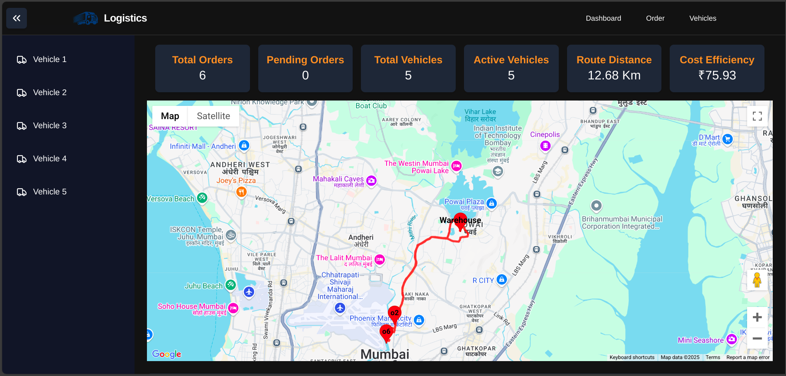

# 🚚 SmartRoute – Optimized Delivery Routing & Time Prediction System

<p align="center">
  
</p>

---

## 🌍 Overview

**SmartRoute** is an AI-powered logistics optimization system designed to streamline delivery operations using:

- 📍 Graph-based route optimization (Shortest Path + TSP)
- 🤖 Machine Learning-based delivery time prediction
- 🚛 Intelligent vehicle assignment system
- 📊 Real-time analytics dashboard
- 🗺️ OpenStreetMap-based spatial data processing

It helps logistics companies reduce delivery time, minimize fuel cost, and improve fleet efficiency using data-driven intelligence.

---

## ⚡ Key Features

### 🚀 Route Optimization
- Uses **NetworkX + OSMnx graph algorithms**
- Solves **Traveling Salesman Problem (TSP)**
- Generates shortest and most efficient delivery paths

### ⏱️ Delivery Time Prediction
- ML model predicts ETA based on:
  - Distance
  - Traffic conditions
  - Weather factors
  - Load weight

### 🚛 Smart Vehicle Assignment
- Orders grouped dynamically
- Capacity-aware allocation
- Priority-based scheduling

### 📊 Real-time Dashboard
- Live route visualization
- Delivery tracking
- Performance analytics

### 🐳 Scalable Architecture
- Dockerized full-stack system
- FastAPI backend + React frontend
- PostgreSQL database support

---

## 🧠 Tech Stack

### Backend
- FastAPI
- Python
- OSMnx (OpenStreetMap)
- NetworkX

### Frontend
- React.js
- JavaScript
- Google Maps API

### Machine Learning
- Scikit-learn
- Random Forest
- Pandas
- NumPy

### Database & Deployment
- PostgreSQL
- Docker
- Docker Compose

---

## ⚙️ Installation & Setup

### 1️⃣ Clone Repository

```bash
git clone https://github.com/Vijay2101/SmartRoute-Optimized-Delivery-Routing-and-Time-Prediction.git
cd SmartRoute-Optimized-Delivery-Routing-and-Time-Prediction
2️⃣ Run Project using Docker
docker-compose up --build
3️⃣ Access Application
🌐 Frontend Dashboard: http://localhost:3000
🔌 Backend API: http://localhost:8000
📸 Screenshots & System Explanation
🧭 1. Route Optimization View

👉 Shows optimized delivery route generated using graph algorithms (Shortest Path + TSP).
This ensures minimum distance travel and efficient delivery planning.

📍 2. Delivery Node Mapping

👉 Displays delivery locations mapped on city graph using OpenStreetMap data.
Helps visualize spatial distribution of orders.

🚛 3. Vehicle Assignment System

👉 Demonstrates how orders are dynamically assigned to vehicles based on:

Capacity
Priority
Weight constraints
📊 4. Analytics Dashboard

👉 Provides real-time performance insights:

Delivery completion rate
Fleet utilization
System efficiency metrics
⏱️ 5. Delivery Time Prediction (ML Output)

👉 Shows machine learning predicted ETA based on:

Distance
Traffic conditions
Weather inputs
🗺️ 6. Full System Overview

👉 Complete integrated dashboard combining:

Routing system
ML predictions
Analytics
Fleet monitoring
📈 Impact
⬇️ Reduced delivery time significantly
⬇️ Lower fuel and operational costs
⬆️ Improved delivery accuracy
⬆️ Better fleet utilization efficiency
🔮 Future Improvements
📡 Real-time GPS tracking system
🌦️ AI-based traffic & weather prediction integration
📱 Mobile app for delivery drivers
☁️ Cloud deployment (AWS / GCP)
🤖 Deep learning-based ETA prediction model
👨‍💻 Developer

Suraj Rawat
Full Stack Developer | AI & ML Enthusiast
