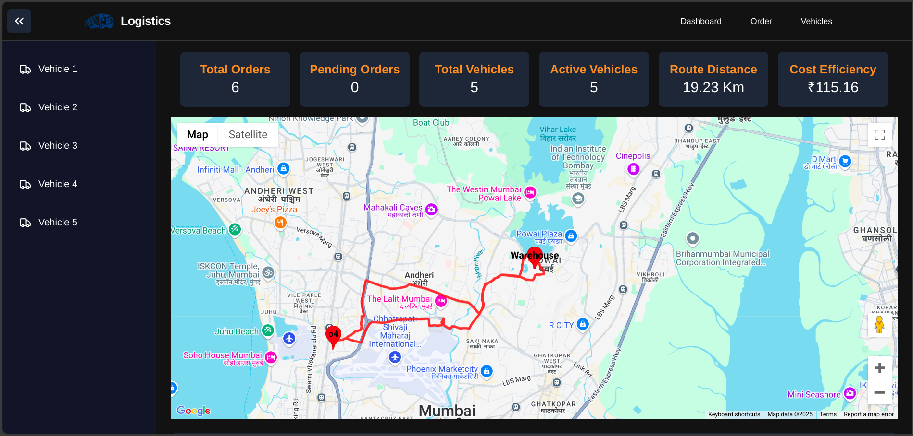
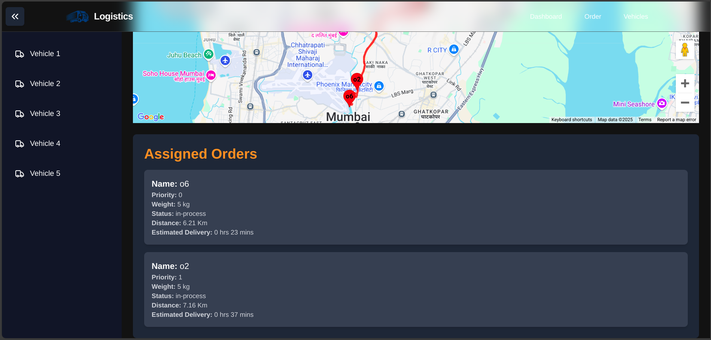
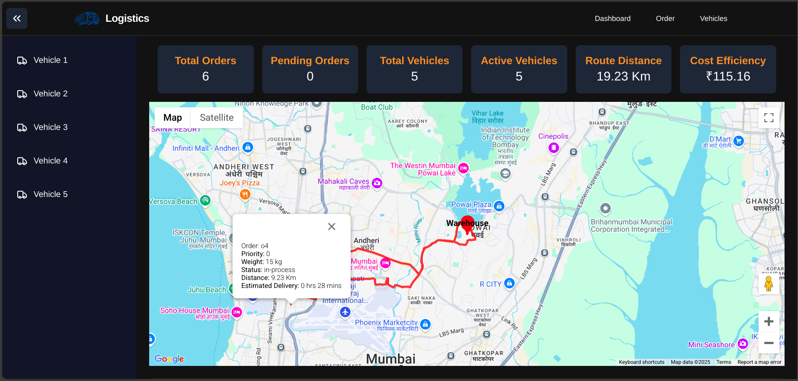
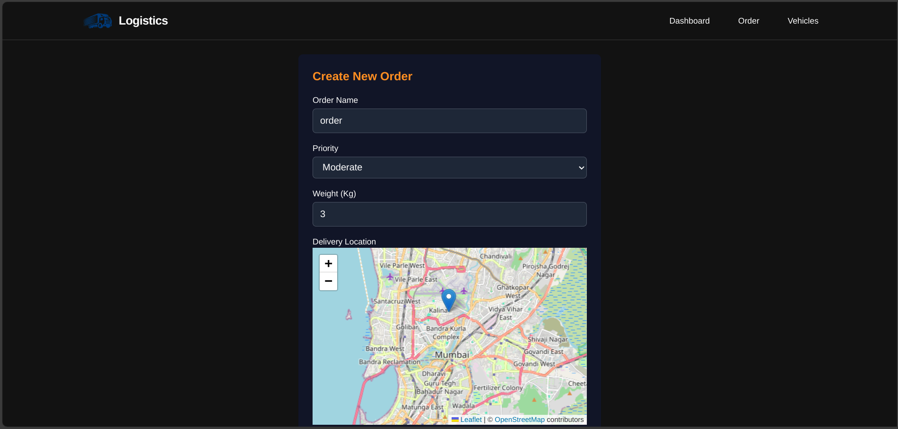
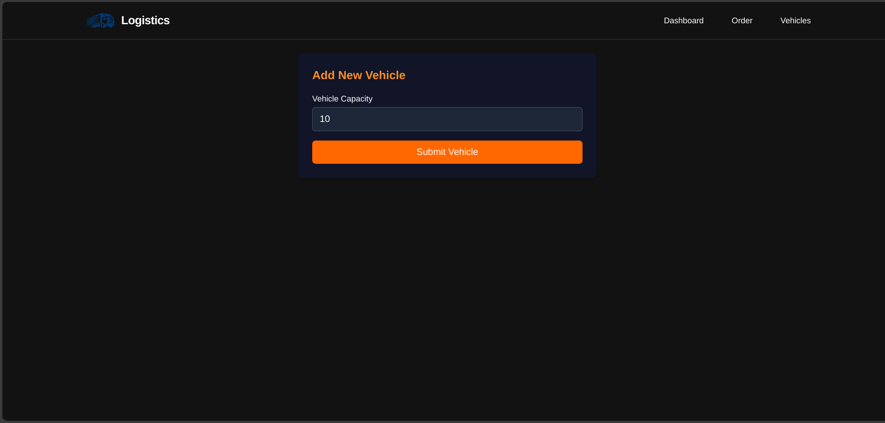

# 🚚 SmartRoute AI  
### Optimized Delivery Routing & Intelligent Time Prediction System

<p align="center">
  
</p>

---

## 🌍 Overview

**SmartRoute** is an AI-powered logistics optimization platform that enhances delivery operations through:

- 📍 Optimized route planning (Graph + TSP algorithms)  
- ⏱️ ML-based delivery time prediction  
- 🚛 Intelligent vehicle allocation  
- 📊 Real-time operational dashboard  

It is designed to reduce delivery cost, improve efficiency, and maximize fleet utilization using data-driven decision making.

---

## ⚡ Key Features

### 🚀 Route Optimization
- Uses **Shortest Path Algorithms (NetworkX / OSMnx)**
- Solves **Traveling Salesman Problem (TSP)** for optimal routing

### ⏱️ Delivery Time Prediction
- Machine Learning model predicts ETA
- Considers **distance, traffic, weather, and load factors**

### 🚛 Smart Fleet Management
- Dynamic order-to-vehicle assignment
- Capacity-based distribution system

### 📊 Real-time Dashboard
- Live route visualization
- Delivery status tracking
- Performance metrics monitoring

### 🐳 Scalable Architecture
- Fully containerized using **Docker & Docker Compose**
- Modular FastAPI backend + React frontend

---

## 🧠 Tech Stack

### Backend
- FastAPI  
- Python  
- OSMnx (OpenStreetMap)  
- NetworkX  

### Frontend
- React.js  
- JavaScript  
- Google Maps API  

### Machine Learning
- Scikit-learn  
- Random Forest Regressor  
- Pandas, NumPy  

### Database & Deployment
- PostgreSQL  
- Docker & Docker Compose  

---

## ⚙️ Installation & Setup

### 1️⃣ Clone Repository
```bash
git clone https://github.com/Vijay2101/SmartRoute-Optimized-Delivery-Routing-and-Time-Prediction.git
cd SmartRoute-Optimized-Delivery-Routing-and-Time-Prediction
2️⃣ Run with Docker
docker-compose up --build
3️⃣ Access Application
🌐 Frontend Dashboard: http://localhost:3000
🔌 Backend API: http://localhost:8000
📸 Screenshots
<p align="center">   </p> <p align="center">   </p> <p align="center">   </p>
📈 Impact & Results
⬇️ Reduced delivery time through optimized routing
⬇️ Lower operational and fuel costs
⬆️ Improved delivery accuracy (ML-based ETA)
⬆️ Better fleet utilization efficiency
🔮 Future Enhancements
📡 Real-time GPS tracking system
🌦️ Live traffic + weather-based rerouting
📱 Mobile application (Driver App)
☁️ Cloud deployment (AWS / GCP)
🤖 Advanced deep learning ETA model
👨‍💻 Developer

Suraj Rawat
Full Stack Developer | AI & ML Enthusiast
